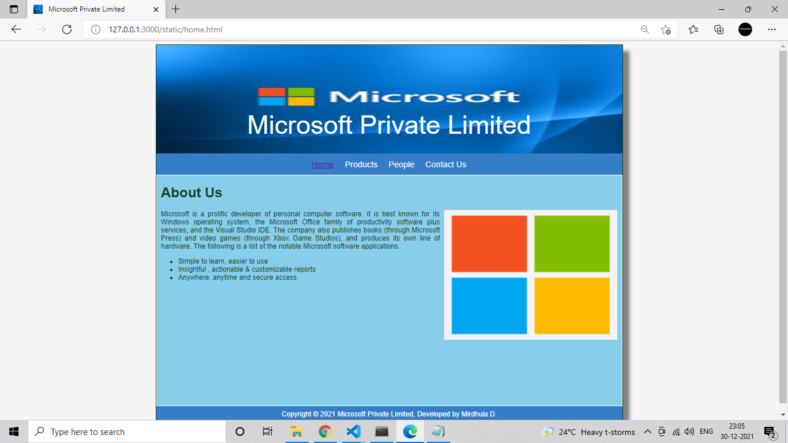
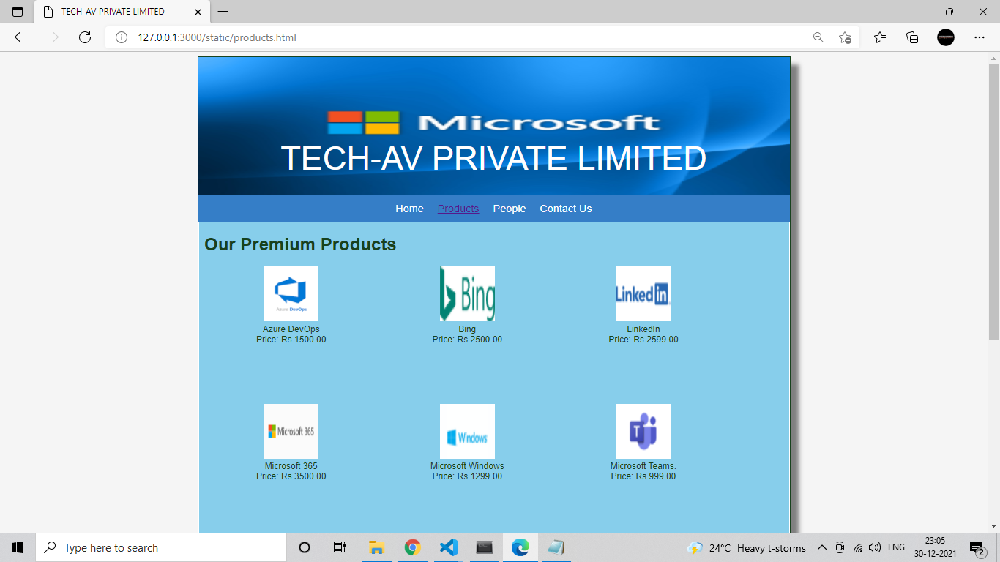
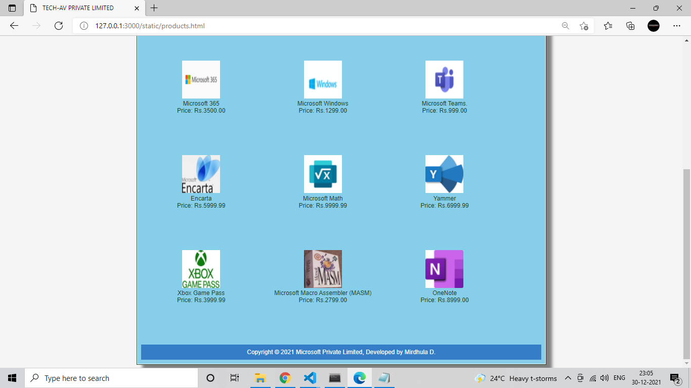
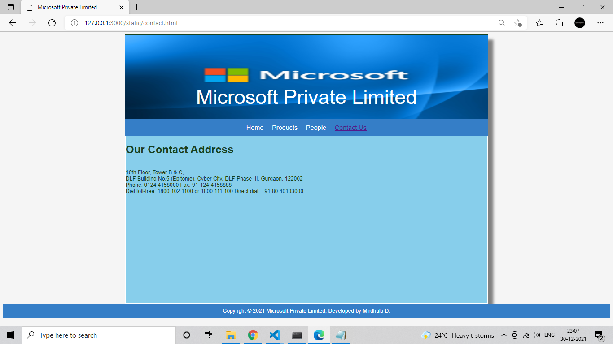

# Web Design for a Software Product Company

## AIM:

To design a static website for a software product company company.

## DESIGN STEPS:

### Step 1:

Requirement collection.

### Step 2:

Creating the layout using HTML and CSS.

### Step 3:

Updating the sample content.

### Step 4:

Choose the appropriate style and color scheme.

### Step 5:

Validate the layout in various browsers.

### Step 6:

Validate the HTML code.

### Step 6:

Publish the website in the given URL.

## PROGRAM :
### Home Page:
```
<!DOCTYPE html>
<html lang="en">
  <head>
    <title>Microsoft Private Limited</title>
    <link rel="stylesheet" href="./css/layout.css" />
    <link rel="icon" href="./img/icon.jpg" type="image/x-icon" />
  </head>

  <body>
    <div class="container">
      <div class="banner">Microsoft Private Limited</div>
      <div class="menu">
        <div class="menuitemselected"><a href="/static/home.html">Home</a></div>
        <div class="menuitem"><a href="/static/products.html">Products</a></div>
        <div class="menuitem"><a href="/static/people.html">People</a></div>
        <div class="menuitem"><a href="/static/contact.html">Contact Us</a></div>
      </div>
      <div class="content">
        <div class="homecontent">
          <h1>About Us</h1>
          
          <div class="contenttext">
            Microsoft is a prolific developer of personal computer software. 
            It is best known for its Windows operating system, the Microsoft 
            Office family of productivity software plus services, and the 
            Visual Studio IDE. The company also publishes books (through Microsoft Press) 
            and video games (through Xbox Game Studios), and produces its own line 
            of hardware. The following is a list of the notable Microsoft software applications.
            <ul>
              <li>Simple to learn, easier to use</li>
              <li>Insightful , actionable & customizable reports</li>
              <li>Anywhere, anytime and secure access</li>
            </ul>
          </div>
        </div>
      </div>
      <div class="footer">
        Copyright &#169; 2021 Microsoft Private Limited, Developed by Mirdhula D.
      </div>
    </div>
  </body>
</html>
```
### Product Page:
```
<!DOCTYPE html>
<html lang="en">
  <head>
    <title>TECH-AV PRIVATE LIMITED</title>
    <link rel="stylesheet" href="./css/layout.css" />
    <link rel="icon" href="./img/icon.png" type="image/x-icon" />
  </head>

  <body>
    <div class="container">
      <div class="banner">TECH-AV PRIVATE LIMITED</div>
      <div class="menu">
        <div class="menuitem"><a href="/static/home.html">Home</a></div>
        <div class="menuitemselected">
          <a href="/static/products.html">Products</a>
        </div>
        <div class="menuitem"><a>People</a></div>
        <div class="menuitem"><a>Contact Us</a></div>
      </div>
      <div class="content">
        <div class="productcontent">    
          <h1>Our Premium Products</h1>
          <div class="productitems">
              <div class="productitem"> 
                  <div class="itemimage">
                  
                  </div>
                  <div class="itemname">Azure DevOps</div>
                  <div class="itemprice">Price: Rs.1500.00 </div>
              </div>
              <div class="productitem"> 
                  <div class="itemimage">
                  
                  </div>
                  <div class="itemname">Bing</div>
                  <div class="itemprice">Price: Rs.2500.00 </div>
              </div>
              <div class="productitem"> 
                  <div class="itemimage">
                  
                  </div>
                  <div class="itemname">LinkedIn</div>
                  <div class="itemprice">Price: Rs.2599.00 </div>
              </div>
              <div class="productitem"> 
                  <div class="itemimage">
                  
                  </div>
                  <div class="itemname">Microsoft 365</div>
                  <div class="itemprice">Price: Rs.3500.00 </div>
              </div>
              <div class="productitem"> 
                  <div class="itemimage">
                  
                  </div>
                  <div class="itemname">Microsoft Windows</div>
                  <div class="itemprice">Price: Rs.1299.00 </div>
              </div>
              <div class="productitem"> 
                  <div class="itemimage">
                  
                  </div>
                  <div class="itemname">Microsoft Teams.</div>
                  <div class="itemprice">Price: Rs.999.00 </div>
              </div>
              <div class="productitem"> 
                  <div class="itemimage">
                  
                  </div>
                  <div class="itemname">Encarta</div>
                  <div class="itemprice">Price: Rs.5999.99 </div>
              </div>
              <div class="productitem"> 
                  <div class="itemimage">
                  
                  </div>
                  <div class="itemname">Microsoft Math</div>
                  <div class="itemprice">Price: Rs.9999.99</div>
              </div>
              <div class="productitem"> 
                  <div class="itemimage">
                  
                  </div>
                  <div class="itemname">Yammer</div>
                  <div class="itemprice">Price: Rs.6999.99 </div>
              </div>
              <div class="productitem"> 
                  <div class="itemimage">
                  
                  </div>
                  <div class="itemname">Xbox Game Pass</div>
                  <div class="itemprice">Price: Rs.3999.99 </div>
              </div>
              <div class="productitem"> 
                  <div class="itemimage">
                  
                  </div>
                  <div class="itemname">Microsoft Macro Assembler (MASM)</div>
                  <div class="itemprice">Price: Rs.2799.00 </div>
              </div>
              <div class="productitem"> 
                  <div class="itemimage">
                  
                  </div>
                  <div class="itemname">OneNote</div>
                  <div class="itemprice">Price: Rs.8999.00 </div>
              </div>       
      </div>
      <div class="footer">
        Copyright &#169; 2021 Microsoft Private Limited, Developed by Mirdhula D.
      </div>
    </div>
  </body>
</html>
```
### People page:
```
<!DOCTYPE html>
<html lang="en">
  <head>
    <title>Microsoft Private Limited</title>
    <link rel="stylesheet" href="./css/layout.css" />
    <link rel="icon" href="./img/globee.png" type="image/x-icon" />
  </head>

  <body>
    <div class="container">
      <div class="banner">Microsoft Private Limited</div>
      <div class="menu">
        <div class="menuitem"><a href="/static/home.html">Home</a></div>
        <div class="menuitem"><a href="/static/products.html">Products</a></div>  
        <div class="menuitemselected"><a href ="/static/people.html"></a>People</a></div>
        <div class="menuitem"><a href="/static/contact.html">Contact Us</a></div>
      </div>
      <div class="content">
      <div class="productitem"> 
        <div class="itemimage">
        
      </div>
         <div class="itemname">Satya Nadella</div>
         <div class="itemname">CEO of Microsoft</div>
      </div>
      <div class="productitem"> 
        <div class="itemimage">
        
      </div>
         <div class="itemname">Steve Ballmer</div>
         <div class="itemname">Microsoft CEO </div>
      </div>
      <div class="productitem"> 
        <div class="itemimage">
        
      </div>
        <div class="itemname">Benedetto vigna</div>
        <div class="itemname">PRODUCER</div>
      </div>
      <div class="productitem"> 
        <div class="itemimage">
        
      </div>
        <div class="itemname">Florin Talpeș</div>
        <div class="itemname">Manager</div>
      </div>
      <div class="productitem"> 
        <div class="itemimage">
        
      </div>
        <div class="itemname">Mr. Shrishail Rana</div>
        <div class="itemname">Asst Manager</div>
      </div>
      <div class="productitem"> 
        <div class="itemimage">
        
      </div>
        <div class="itemname">Manoj V</div>
        <div class="itemname">Team Manager</div>
      </div>
      <div class="footer">
        Copyright &#169; 2021 Microsoft Private Limited, Developed by Mirdhula D.
      </div>
    </div>
  </body>
</html>
```
### Contact Page:
```
<!DOCTYPE html>
<html lang="en">
  <head>
    <title>Microsoft Private Limited</title>
    <link rel="stylesheet" href="./css/layout.css" />
    <link rel="icon" href="./img/globee.png" type="image/x-icon" />
  </head>
  
  <body>
    <div class="container">
      <div class="banner">Microsoft Private Limited</div>
      <div class="menu">
        <div class="menuitem"><a href="/static/home.html">Home</a></div>
        <div class="menuitem"><a href="/static/products.html">Products</a></div>  
        <div class="menuitem"><a href="/static/people.html">People</a></div>
        <div class="menuitemselected"><a href="/static/contact.html">Contact Us</a></div>
      </div>
      
        <div class="contact content">
           <h1>Our Contact Address</h1>  
        
          <div class="contacttext">
            10th Floor, Tower B & C,
            DLF Building No.5 (Epitome),
            Cyber City, DLF Phase III,
            Gurgaon, 122002
            Phone: 0124 4158000
            Fax: 91-124-4158888
            
            Dial toll-free: 1800 102 1100 or 1800 111 100
            Direct dial: +91 80 40103000
          </div>
        </div>

     
<div class="footer">
  Copyright &#169; 2021 Microsoft Private Limited, Developed by Mirdhula D.
</div>
</div>
</body>
</html>
```
## OUTPUT:

### Home Page:


### Product Page:


### People Page:

### Contact Page:


## Result:

Thus a website is designed for the software product company and the HTML,CSS code are validated.
